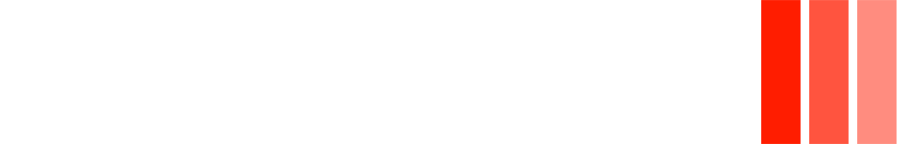

<h1 style="font-size: 50px;margin: 20px 0px">   TenZ </h1>

 Tyson "TenZ" Ngo (born May 5, 2001) is a Canadian player who is currently playing for Sentinels. He is a former Counter-Strike: Global Offensive player known for his time on Cloud9. TenZ was the first player to reach Valorant rank (now known as Radiant) in North America during the Closed Beta.

<h2 style="font-size: 30px;margin-top:20px">Controls & Settings -</h2> 

<h2 style="font-size: 30px;margin-top:20px">Achievements & Awards -</h2> 

    

        
        
        
        
        
    

    
 
 ©2022 Copyright gamePlay. All Rights Reserved. 
 

